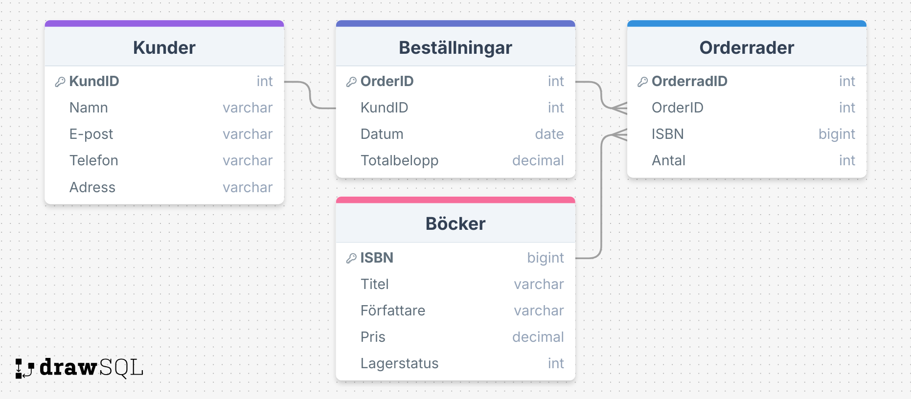

# Inlamning1

## En liten bokhandel Av Lucas Wenehult YH25
Nu har jag skappat en databas för en liten bokhandel. I databasen har jag skapat tabeller för de olika delarna som krävs för att kunna gör en beställning online. I uppgiften finns en SQL fil som skapar databasen samt skapar tabellerna som behövs och även lägger in information för att se hur strukturen fungerar i praktiken. SQL koden avslutas med en SELECT fråga som visar informationen från en av tabelerna. ER-diagrammet som finns med längre ner visar tabellerna och deras primärnycklar, främmande nycklar och relationerna mellan tabellerna.

### Lärdomar 
Under uppgiften FIck jag dra lärdommen att man inte kan använda INT för ISBN då det inte ger tillräckligt med siffror. Därför fick jag istället använda BIGINT för att det skulle funka.

